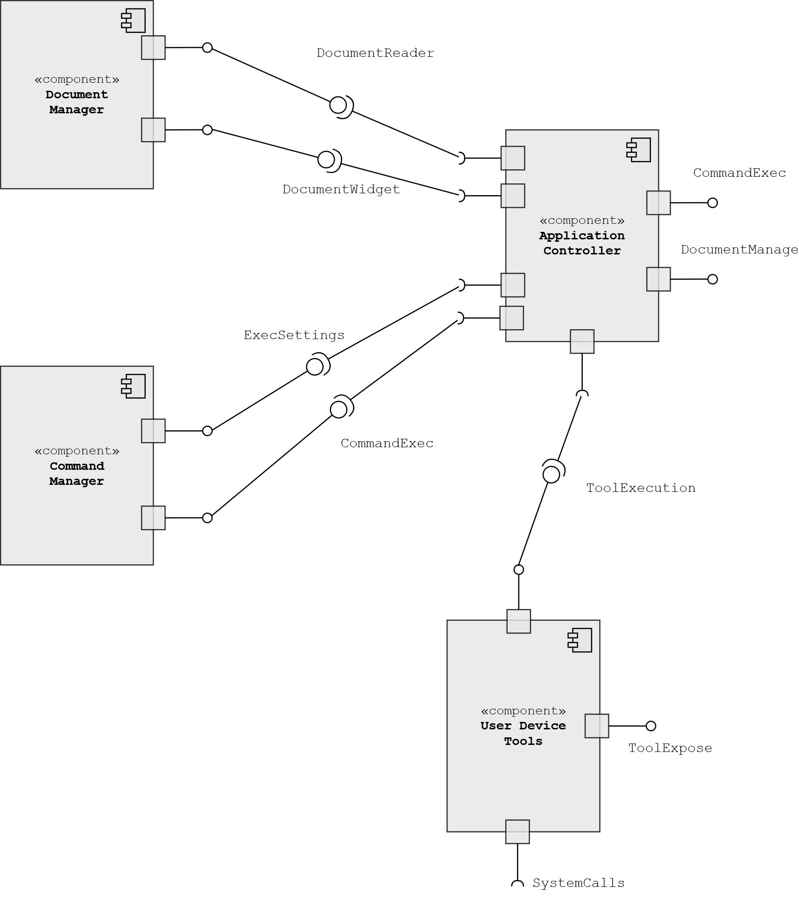

# Axioma

__Axioma__ is a desktop application for retrieval-augmented generation (RAG) focused on tackling package __dependency hell__, a commonly encountered problem in AI-assisted code production. 

It's achieved through user interaction with the document tree organized identical to file systems in the GUI. These documents arranged in hierarchy can be thought of as __axioms__ since the RAG-production is completely contingent on what directory or what documents you have chosen in the GUI. 

In addition to choosing the specific version of a package, clients are permitted to choose any subset of directories in which there are documents the RAG searches.

## Introduction

Currently I introduce the following features:

- Connection to the custom backend using vector databases
- File system-like hierarchical view of the database documents
- Selective (documents or directories) search over the database from the GUI
- GUI allows OS tools to be used by the response by the LLM-based agent (`mkdir`, `touch`, `ls` etc.)

The last feature is where the GUI allows the application to take charge in defining the code environment, possibly creating build scripts itself and running the tests accordingly. Web frontend apps would hit massive security barriers carrying out such file operations, process execution, etc. That's why I chose a desktop app to be the main actuator that executes payloads returned from the server where the agent (specifically ReAct agent) is functioning.

_to be specified further..._

## Structure

Currently, I devised the component diagram as follows.

_to be specified further..._
